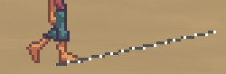

Starts the character moving from its current location to (X,Y), whilst playing his walking animation.

If _blocking_ is eNoBlock (the default) then control returns to the script immediately, and the character will move in the background.

If _blocking_ is eBlock then this command will wait for the character to finish moving before your script resumes.

If _walkWhere_ is eWalkableAreas (the default), then the character will attempt to get as close a possible to (X,Y) by using the room's walkable areas.

If _walkWhere_ is eAnywhere, then the character will simply walk directly from its current location to (X,Y), ignoring the room walkable areas.

If you don't want the character's walking animation to play, you can use the [Move](Move) command instead.

**NOTE:** this function only works with characters which are on the current screen.

**NOTE:** if you need to find out when the character has reached its destination, use the [Moving](Moving) property.
